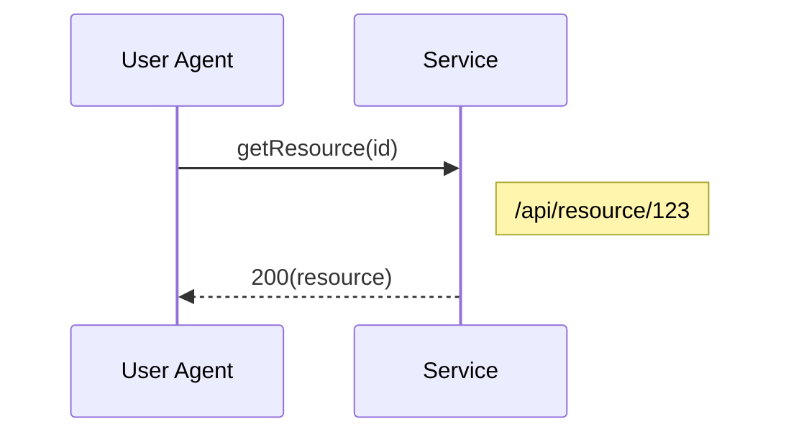
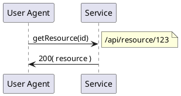

# Migration from PlantUML to Mermaid

## Assessment

### ✅ **Yes, Mermaid is an excellent replacement for PlantUML in your use case**

**Advantages:**
- ✅ **No Java dependency** - Pure JavaScript, eliminates installation issues
- ✅ **Simpler syntax** - Easier to generate and maintain
- ✅ **Better web integration** - Can render client-side or server-side
- ✅ **Active development** - Well-maintained with large community
- ✅ **GitHub/GitLab native support** - Diagrams render in markdown files
- ✅ **Smaller bundle size** - No need for Java runtime

**Your current PlantUML usage:**
- Simple sequence diagrams (perfect for Mermaid)
- Server-side PNG rendering
- Stored as encoded text in database

## Migration Difficulty: **EASY to MODERATE**

The migration is straightforward because:
1. Your `pumlfy()` function generates simple sequence diagram syntax
2. Mermaid sequence diagram syntax is very similar
3. You can keep the same database structure (just change the syntax)
4. Both support PNG/SVG output

## Migration Steps

### Step 1: Update Dependencies

Replace in `server/package.json`:
```json
// Remove:
"node-plantuml": "^0.9.0",
"plantuml-encoder": "^X.X.X",

// Add:
"@mermaid-js/mermaid-cli": "^10.6.1",
"mermaid": "^10.6.0"
```

### Step 2: Update the Controller

**Current PlantUML syntax example:**
```plantuml
"User Agent" -> "Service": getResource(id)
note right: /api/resource/123
"Service" -> "User Agent": 200( resource )
```

**Equivalent Mermaid syntax:**


### Step 3: Code Changes

#### Option A: Server-Side Rendering (PNG/SVG)

```javascript
// Replace in hars.server.controller.js

const { exec } = require('child_process');
const fs = require('fs');
const path = require('path');
const { promisify } = require('util');
const execAsync = promisify(exec);

// Replace pumlfy function
function mermaidify(log, callback) {
  let mermaidText = 'sequenceDiagram\n';
  mermaidText += '    participant UA as "User Agent"\n';
  
  // Collect unique services
  const services = new Set();
  for (var entry in log.entries) {
    if (log.entries.hasOwnProperty(entry)) {
      const requestUrlObj = url.parse(log.entries[entry].request.url);
      const serviceName = log.entries[entry]['x-service-name'] || 
                         requestUrlObj.hostname || 'Service';
      services.add(serviceName);
    }
  }
  
  // Add participants
  services.forEach((service, index) => {
    mermaidText += `    participant S${index} as "${service}"\n`;
  });
  
  mermaidText += '\n';
  
  // Generate sequence
  let serviceIndex = 0;
  const serviceMap = new Map();
  services.forEach((service, idx) => {
    serviceMap.set(service, idx);
  });
  
  for (var entry in log.entries) {
    if (log.entries.hasOwnProperty(entry)) {
      const requestUrlObj = url.parse(log.entries[entry].request.url);
      const serviceName = log.entries[entry]['x-service-name'] || 
                         requestUrlObj.hostname || 'Service';
      const resourceName = log.entries[entry]['x-resource-name'] || 
                          requestUrlObj.pathname.split("/").pop();
      const method = log.entries[entry].request.method.toLowerCase();
      const resStatus = log.entries[entry].response.status;
      
      const serviceIdx = serviceMap.get(serviceName) || 0;
      
      // Query params
      let queryParams = '';
      for (var qParam in log.entries[entry].request.queryString) {
        queryParams += log.entries[entry].request.queryString[qParam].name + ', ';
      }
      // Path params
      let pathParams = '';
      for (var pParam in log.entries[entry].request['x-path-params']) {
        pathParams += log.entries[entry].request['x-path-params'][pParam].name + ', ';
      }
      const allParams = (queryParams + pathParams).replace(/,\s*$/, '');
      
      const methodName = method + resourceName.charAt(0).toUpperCase() + resourceName.slice(1);
      const paramsStr = allParams ? `(${allParams})` : '()';
      
      // Request
      mermaidText += `    UA->>S${serviceIdx}: ${methodName}${paramsStr}\n`;
      
      // Note
      if (requestUrlObj.pathname) {
        mermaidText += `    Note right of S${serviceIdx}: ${requestUrlObj.pathname}\n`;
      }
      
      // Response
      const resStatusText = resStatus === 200 ? '' : ` ${log.entries[entry].response.statusText}`;
      mermaidText += `    S${serviceIdx}-->>UA: ${resStatus}(${resourceName}${resStatusText})\n`;
    }
  }
  
  if (typeof callback === 'function') {
    callback(mermaidText);
  }
}

// Replace readUML function
exports.readUML = async function (req, res) {
  try {
    const har = req.har;
    const mermaidText = har.mermaid || har.puml; // Support both during migration
    
    // If it's still PlantUML encoded, decode it first
    let diagramText = mermaidText;
    if (mermaidText && mermaidText.startsWith('@startuml')) {
      // Still PlantUML, would need to convert or use old method
      // For now, return error or convert
      return res.status(400).send({ message: 'Please regenerate diagram with Mermaid' });
    }
    
    // Create temp file
    const tempDir = path.join(__dirname, '../../../../tmp');
    if (!fs.existsSync(tempDir)) {
      fs.mkdirSync(tempDir, { recursive: true });
    }
    const tempInput = path.join(tempDir, `mermaid-${har._id}.mmd`);
    const tempOutput = path.join(tempDir, `mermaid-${har._id}.png`);
    
    // Write Mermaid text to file
    fs.writeFileSync(tempInput, diagramText);
    
    // Render using mermaid-cli
    await execAsync(`npx @mermaid-js/mermaid-cli -i "${tempInput}" -o "${tempOutput}" -b white`);
    
    // Read and send PNG
    const image = fs.readFileSync(tempOutput);
    res.set('Content-Type', 'image/png');
    res.send(image);
    
    // Cleanup
    fs.unlinkSync(tempInput);
    fs.unlinkSync(tempOutput);
  } catch (err) {
    console.error('Mermaid rendering error:', err);
    res.status(500).send({ message: 'Error rendering diagram: ' + err.message });
  }
};

// Replace createUML function
exports.createUML = function (req, res) {
  const har = req.har;
  const log = har.log;
  
  mermaidify(log, function (mermaidText) {
    // Store Mermaid text directly (no encoding needed)
    har.mermaid = mermaidText;
    // Keep puml for backward compatibility during migration
    // har.puml = null; // Eventually remove
    
    har.save(function (err) {
      if (err) {
        return res.status(400).send({
          message: errorHandler.getErrorMessage(err)
        });
      } else {
        res.jsonp(har);
      }
    });
  });
};
```

#### Option B: Client-Side Rendering (Recommended - Simpler!)

This is actually the **better approach** for your use case:

1. **Send Mermaid text to client** instead of rendered image
2. **Render in browser** using Mermaid.js
3. **No server-side rendering needed** - eliminates complexity

**Server changes:**
```javascript
// Simplified readUML - just return the Mermaid text
exports.readUML = function (req, res) {
  const har = req.har;
  res.set('Content-Type', 'text/plain');
  res.send(har.mermaid || har.puml || '');
};

// createUML stays the same (generates Mermaid text)
```

**Client changes (in view-har.client.view.html):**
```html
<!-- Replace the  tag with: -->
<div class="mermaid-diagram">
  <pre class="mermaid">{{vm.har.mermaid || vm.har.puml}}</pre>
</div>

<!-- Add Mermaid script -->
<script src="https://cdn.jsdelivr.net/npm/mermaid@10/dist/mermaid.min.js"></script>
<script>
  mermaid.initialize({ startOnLoad: true, theme: 'default' });
</script>
```

Or use AngularJS directive:
```javascript
// In client controller or directive
$scope.$watch('har.mermaid', function(newVal) {
  if (newVal) {
    $timeout(function() {
      mermaid.init(undefined, document.querySelector('.mermaid-diagram'));
    });
  }
});
```

## Comparison: PlantUML vs Mermaid Syntax

### PlantUML (Current)


### Mermaid (Proposed)


## Recommendation

**Use Client-Side Rendering (Option B)** because:
1. ✅ Simpler - no server-side rendering complexity
2. ✅ Faster - no image generation overhead
3. ✅ Interactive - users can zoom/pan SVG
4. ✅ No dependencies - just include Mermaid.js script
5. ✅ Better UX - instant rendering, no image loading

## Migration Checklist

- [ ] Update `server/package.json` dependencies
- [ ] Replace `pumlfy()` with `mermaidify()`
- [ ] Update `createUML()` to store Mermaid text
- [ ] Update `readUML()` (choose server-side or client-side)
- [ ] Update client-side view to render Mermaid
- [ ] Update database model (add `mermaid` field, keep `puml` for migration)
- [ ] Test with existing HAR files
- [ ] Remove PlantUML dependencies after migration complete

## Estimated Time

- **Simple migration (client-side)**: 2-3 hours
- **Server-side migration**: 4-6 hours (includes Puppeteer setup)

## Benefits After Migration

1. ✅ No Java installation required
2. ✅ Faster `npm install` (no postinstall script failures)
3. ✅ Better developer experience
4. ✅ Smaller deployment size
5. ✅ More modern tooling

